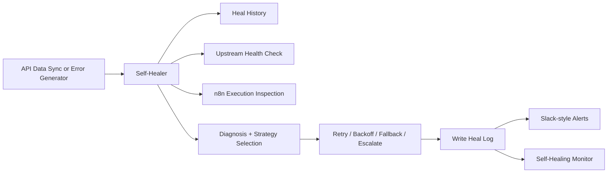
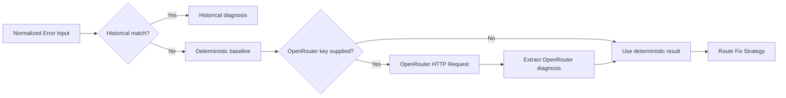
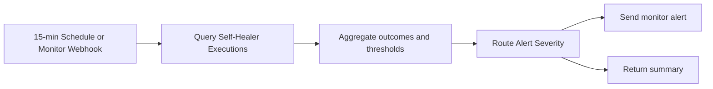

# Self-Healing n8n Workflow


**A code-first n8n workflow set that detects failures, diagnoses them, attempts recovery, and gets cheaper over time.** The project includes a caller workflow, a self-healer, a simulator for known failure classes, and a monitoring workflow that watches recent healing outcomes.

## Why This Is Different

Traditional n8n recovery flows can call an LLM every time an error appears. This system does not.

The self-healer has a **learning loop**:

- first-time errors can use OpenRouter for diagnosis
- deterministic rules provide a safe baseline when no key is present
- once the same `error_type` has healed successfully `3` times, the `4th` matching error skips the LLM and routes from stored history

That means repeated failures become **zero-token diagnoses** instead of recurring inference spend.

## Benchmark Snapshot

Latest benchmark report: [benchmark.md](benchmark.md)

Measured on the live workflows on 2026-04-16:

| Claim | Measured result |
|---|---|
| Learning-loop threshold | `4th` identical healed error is the first `historical` run |
| OpenRouter average before learning | `359` tokens and `$0.000943` per diagnosis |
| Learned retry case | `379 ms`, `0` tokens, `0` LLM calls |
| Scenario sweep mix | `4/6` live simulator scenarios already route through `historical` |
| Projection at 70% repeat rate | `70` fewer LLM calls, `25,130` fewer tokens, `$0.0660` lower cost per `100` errors |

This is the core value proposition: **the workflow does not just auto-heal, it compounds what it learns and reduces future diagnosis cost.**

This is a live, payload-driven recovery system for an n8n instance where `$env` is blocked inside expressions. Runtime secrets and overrides are forwarded explicitly in webhook payloads instead of being read from workflow expressions.

Tracked workflow IDs, dated verification evidence, and live checks are in [docs/verification.md](docs/verification.md). Operational guidance lives in [docs/runbook.md](docs/runbook.md) and [docs/monitoring.md](docs/monitoring.md).

## How It Works

The system follows a 5-step recovery loop:

1. **Fail** — `API Data Sync` or `Error Generator` produces a structured error payload.
2. **Enrich** — `Self-Healer` adds heal history, upstream reachability, and optional n8n execution inspection.
3. **Diagnose** — It prefers historical patterns first, uses deterministic rules as a baseline, and optionally calls OpenRouter through workflow HTTP nodes.
4. **Recover** — It chooses `retry`, `backoff`, `fallback`, or `escalate`.
5. **Observe** — It writes heal logs, emits Slack-style alerts, and `Self-Healing Monitor` aggregates recent outcomes every 15 minutes or on demand.

A single failing caller execution can produce a healed response with the chosen strategy, diagnosis source, and inspected execution context.

## Learning Loop

The learning loop is implemented in `Self-Healer` through workflow static data:

1. Every execution writes a heal log entry with `error_type`, `diagnosis_source`, `fix_strategy`, `outcome`, and success-rate rollups.
2. The diagnosis node checks recent history for the same `error_type`.
3. If one strategy has at least `3` healed matches, that strategy becomes the dominant repair pattern.
4. The next matching execution returns `diagnosis_source: historical`, skips OpenRouter entirely, and reuses the learned strategy.

Observed benchmark sequence:

| Run | Execution | Source | Tokens | Strategy | Outcome |
|---|---:|---|---:|---|---|
| 1 | `1977` | `openrouter` | 324 | `retry` | healed |
| 2 | `1978` | `openrouter` | 357 | `retry` | healed |
| 3 | `1979` | `openrouter` | 396 | `retry` | healed |
| 4 | `1980` | `historical` | 0 | `retry` | healed |

That is the behavior to sell: the system stops paying for diagnosis once it has enough evidence.

## Live Workflows

| Workflow | ID | Webhook | Purpose |
|---|---|---|---|
| `API Data Sync` | `jBbMvA2RK39YlEM9` | `POST /webhook/api-data-sync` | Main caller workflow that fetches, transforms, stores, and forwards failures |
| `Self-Healer` | `85XCB5Us5UVyu3Da` | `POST /webhook/self-healer` | Diagnosis and recovery workflow |
| `Error Generator` | `rWAEEC4nCqojdRtu` | `POST /webhook/simulate-error` | Safe simulator for known failure classes |
| `Self-Healing Monitor` | `nrpTCtxXa9OxzbZG` | `POST /webhook/self-healing-monitor` | Threshold-based monitoring and alerting |

## Runtime Model

This n8n instance blocks `$env` access inside node expressions. Because of that, the public webhook entrypoints accept runtime values directly in the payload:

- `openrouter_api_key`
- `openrouter_model`
- `slack_webhook_url`
- `n8n_api_key`
- `execution_id`
- `self_healer_webhook_url`

`n8n_api_key` is required when the caller wants execution inspection or when the monitor queries the n8n executions API. `execution_id` is optional for direct healer calls, but `API Data Sync` now forwards its own execution ID automatically when `n8n_api_key` is supplied.

## Recovery Paths

| Path | Trigger | Behavior |
|---|---|---|
| **Historical** | Same error type healed repeatedly | Skips LLM, reuses the dominant successful strategy |
| **Deterministic** | No reliable history or OpenRouter unavailable | Uses the built-in strategy matrix |
| **OpenRouter** | API key supplied and no historical short-circuit | Calls OpenRouter through an `HTTP Request` node, then parses or falls back safely |
| **Execution Inspection** | `execution_id` + `n8n_api_key` supplied | Pulls `includeData=true` execution payload and summarizes the failing node context |
| **Monitoring** | Schedule or monitor webhook | Aggregates recent self-healer runs and routes warning/high alerts |

If you want the full OpenRouter path and token accounting in production or during demos, you need a valid funded `OPENROUTER_API_KEY`. If no key is supplied, or a pattern is already learned, the system still works through `deterministic` or `historical` routing.

## Supported Error Types

| Error type | Expected strategy | Notes |
|---|---|---|
| `429` | `backoff` | Rate limit handling with delayed retry |
| `500` | `retry` | Immediate retry when the dependency is still reachable |
| `401` | `escalate` | Requires manual credential rotation |
| `parse` | `fallback` | Emits safe fallback payload |
| `timeout` | `backoff` | Retries after a short wait |
| `schema` | `fallback` | Adapts malformed or changed response shape |
| unknown value | `escalate` | Deterministic fallback for unsupported patterns |

## Usage Examples

### Successful Sync

```bash
curl -X POST http://172.31.224.1:5678/webhook/api-data-sync \
  -H "Content-Type: application/json" \
  -d '{
    "max_items": 5
  }'
```

Expected result:

- records are transformed
- the latest snapshot is written to workflow static data
- the response reports `status=success`

### Force A Healed Failure Through API Data Sync

```bash
curl -X POST http://172.31.224.1:5678/webhook/api-data-sync \
  -H "Content-Type: application/json" \
  -d '{
    "force_write_error": true,
    "n8n_api_key": "'"$N8N_API_KEY"'"
  }'
```

Expected healed response fields include:

- `execution_id`
- `execution_context.failed_node`
- `execution_context.failed_node_input`

### Simulate A Known Failure Class

```bash
curl -X POST http://172.31.224.1:5678/webhook/simulate-error \
  -H "Content-Type: application/json" \
  -d '{
    "error_type": "401",
    "openrouter_api_key": "'"$OPENROUTER_API_KEY"'",
    "slack_webhook_url": "'"$SLACK_WEBHOOK_URL"'"
  }'
```

Supported simulator `error_type` values:

- `429`
- `500`
- `401`
- `parse`
- `timeout`
- `schema`

To run all six scenarios in sequence:

```bash
export N8N_BASE_URL="http://172.31.224.1:5678"
npm run demo:errors
```

### Call The Healer Directly

```bash
curl -X POST http://172.31.224.1:5678/webhook/self-healer \
  -H "Content-Type: application/json" \
  -d '{
    "error_type": "401",
    "error_message": "Authentication failed",
    "node_name": "Fetch Source Posts",
    "workflow_name": "API Data Sync",
    "input_data": {"source_url": "https://jsonplaceholder.typicode.com/posts"},
    "retry_target_url": "",
    "retry_method": "GET",
    "execution_id": "1234",
    "n8n_api_key": "'"$N8N_API_KEY"'",
    "openrouter_api_key": "'"$OPENROUTER_API_KEY"'",
    "slack_webhook_url": "'"$SLACK_WEBHOOK_URL"'"
  }'
```

### Call The Monitor Directly

```bash
curl -X POST http://172.31.224.1:5678/webhook/self-healing-monitor \
  -H "Content-Type: application/json" \
  -d '{
    "n8n_api_key": "'"$N8N_API_KEY"'",
    "slack_webhook_url": "'"$SLACK_WEBHOOK_URL"'",
    "expect_openrouter": false
  }'
```

The monitor response includes:

- `status`
- `severity`
- `reasons`
- `counts`
- `alert_delivery_status`

## Architecture

### End-To-End Recovery Flow



### Self-Healer Decision Flow



### Monitoring Flow



## Setup

### Prerequisites

- A running [n8n](https://n8n.io) instance
- Node.js 18+
- `N8N_API_KEY` for push, verify, activation, and execution inspection
- Optional `OPENROUTER_API_KEY` and `SLACK_WEBHOOK_URL` for live runtime testing

### Install

```bash
git clone https://github.com/mj-deving/n8n-self-healing.git
cd n8n-self-healing
npm install
git config core.hooksPath .githooks
bd prime

export N8N_API_KEY="<your n8n API key>"
npm run setup:n8n -- http://172.31.224.1:5678
```

### Local Quality Gates

```bash
npm test
npm run validate:workflows
npm run validate
npm run check-secrets
```

### Push To n8n

`workflow.ts` is the source of truth for each workflow package.

```bash
npx --yes n8nac push workflows/pipelines/api-data-sync/workflow/workflow.ts --verify
npx --yes n8nac push workflows/agents/self-healer/workflow/workflow.ts --verify
npx --yes n8nac push workflows/utilities/error-simulator/workflow/workflow.ts --verify
npx --yes n8nac push workflows/utilities/monitor/workflow/workflow.ts --verify
```

## Error Handling

The project is designed to degrade safely:

- heal history can short-circuit diagnosis when the pattern is already known
- deterministic diagnosis is always available even when OpenRouter is absent
- OpenRouter calls happen through workflow HTTP nodes, not Code-node HTTP
- OpenRouter failures fall back to the deterministic result instead of breaking the workflow
- monitor alert delivery can fail independently while the monitor still returns a summary

## Tech Stack

- **[n8n](https://n8n.io)** — workflow automation engine
- **[n8nac](https://github.com/mj-deving/n8n-autopilot)** — code-first workflow development
- **[OpenRouter](https://openrouter.ai)** — optional remote diagnosis provider
- **Workflow Static Data** — heal history, monitor state, and output snapshots
- **[Beads](https://github.com/steveyegge/beads)** — issue tracking and session continuity

## Project Structure

```text
workflows/
  agents/self-healer/              # Diagnosis and recovery workflow
  pipelines/api-data-sync/         # Primary caller workflow
  utilities/error-simulator/       # Known-failure simulator
  utilities/monitor/               # Monitoring and threshold alerting
docs/
  verification.md                  # Live verification evidence
  runbook.md                       # Operator flow and troubleshooting
  monitoring.md                    # Monitor thresholds and incident guidance
scripts/
  demo-all-errors.sh               # Run all six simulator scenarios
  init-n8n.sh                      # Non-interactive n8nac bootstrap helper
  validate-workflows.sh            # Credential-free local validation
.beads/                            # Issue tracking database
```

## Current Status

- local contract tests pass with `npm test`
- local validation passes with `npm run validate:workflows`
- all 4 workflows are pushed and verified in n8n
- execution inspection is propagated from caller to healer
- historical diagnosis is active and live-observed
- monitor workflow is live and webhook-testable
- OpenRouter I/O is externalized into workflow HTTP nodes
- `bd prime` restores repo workflow context

## Verification Snapshot

As of April 16, 2026:

- `API Data Sync` live ID: `jBbMvA2RK39YlEM9`
- `Self-Healer` live ID: `85XCB5Us5UVyu3Da`
- `Error Generator` live ID: `rWAEEC4nCqojdRtu`
- `Self-Healing Monitor` live ID: `nrpTCtxXa9OxzbZG`

Recent live evidence:

- execution `1959` confirmed caller-to-healer execution inspection
- execution `1961` confirmed the OpenRouter HTTP-node branch and safe deterministic fallback after a `401`
- monitor execution `1953` confirmed warning-threshold aggregation and alert-path execution

## License

MIT
