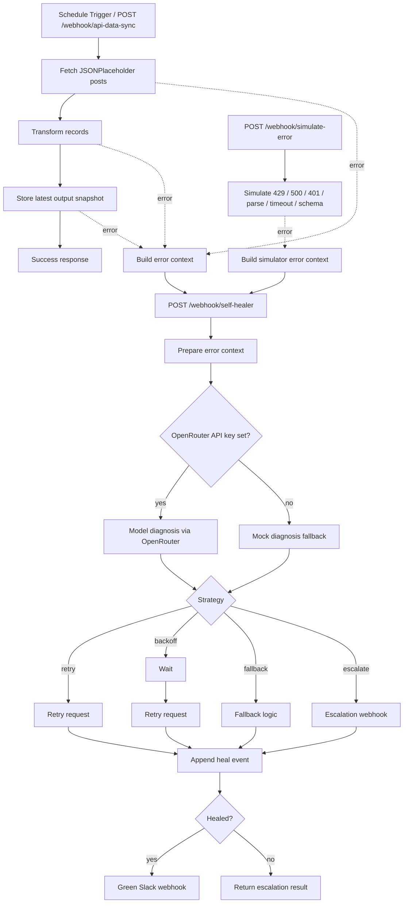

# Self-Healing n8n Workflow

Code-first n8n project that demonstrates a self-healing workflow pattern:

- `API Data Sync` pulls API data, transforms it, stores the latest output snapshot in workflow static data, and forwards recoverable failures to a healer workflow.
- `Self-Healer` diagnoses failures through OpenRouter when credentials are present, falls back to deterministic heuristics when they are not, retries or backs off where possible, records a structured heal log in workflow static data, and emits Slack-style notifications through a webhook URL.
- `Error Generator` simulates six failure classes and routes each of them into the same healer workflow.

## Architecture



## Repository Layout

- `workflow/` root-level single-workflow export placeholder for distribution
- `template/` scaffold source used by `npm run new-workflow`
- `workflows/pipelines/api-data-sync/` primary workflow package
- `workflows/agents/self-healer/` healer sub-workflow package
- `workflows/utilities/error-simulator/` simulator workflow package
- `data/output.json` example payload artifact for local documentation
- `data/heal-log.json` example audit artifact for local documentation
- `docs/` lightweight project site and decision record placeholders
- `assets/` screenshots and diagrams for documentation

## Bootstrap Order

Use this order for a fresh repo created from this scaffold:

1. Install dependencies and enable the repo hooks:

```bash
npm install
git config core.hooksPath .githooks
```

2. Initialize Beads if this copy does not already have `.beads/`, then recover tracker context:

```bash
bd init
bd prime
```

If the repo is already initialized, skip `bd init` and run `bd prime`.

3. Save your n8n API key and initialize `n8nac` non-interactively:

```bash
export N8N_API_KEY="<your n8n API key>"
npm run setup:n8n -- http://172.31.224.1:5678
```

The init wrapper also accepts `[sync-folder] [instance-name]` after the host when a project needs a non-default target path.

4. Run the credential-free validation lane before any live push:

```bash
npm run validate:workflows
npm run validate
```

5. Configure runtime environment for live healing:

```bash
export OPENROUTER_API_KEY="<openrouter key>"
export SLACK_WEBHOOK_URL="https://hooks.slack.com/services/..."
export N8N_BASE_URL="http://172.31.224.1:5678"
```

This n8n instance blocks `$env` access inside node expressions, so the current self-healer expects `openrouter_api_key` and `slack_webhook_url` in the incoming payload or sub-workflow inputs at runtime.

Optional environment variables:

- `SELF_HEALER_WEBHOOK_URL` to override the healer webhook target used by other workflows

6. Push and verify each workflow only after bootstrap and local validation are complete.

## Push to n8n

Push from each workflow directory because `workflow.ts` is the source of truth:

```bash
npx --yes n8nac push /home/mj/projects/n8n-self-healing/workflows/agents/self-healer/workflow/workflow.ts
npx --yes n8nac push /home/mj/projects/n8n-self-healing/workflows/pipelines/api-data-sync/workflow/workflow.ts
npx --yes n8nac push /home/mj/projects/n8n-self-healing/workflows/utilities/error-simulator/workflow/workflow.ts
```

After push, verify each workflow with the returned ID:

```bash
npx --yes n8nac verify <workflow-id>
```

Local validation is available without n8n credentials:

```bash
npm run validate:workflows
npm run validate
```

## Demo

### Happy path

```bash
curl -X POST http://172.31.224.1:5678/webhook/api-data-sync \
  -H "Content-Type: application/json" \
  -d '{
    "max_items": 5
  }'
```

Expected outcome:

- records are transformed to uppercase titles with truncated bodies
- the latest transformed payload is stored in workflow static data under `api-data-sync:last-output`
- webhook response reports `status=success`

### Simulated failures

```bash
curl -X POST http://172.31.224.1:5678/webhook/simulate-error \
  -H "Content-Type: application/json" \
  -d '{ "error_type": "429" }'
```

Supported `error_type` values:

- `429`
- `500`
- `401`
- `parse`
- `timeout`
- `schema`

To run all six scenarios in sequence once the workflows are active:

```bash
npm run demo:errors
```

## Expected Healing Strategies

| Error type | Expected strategy | Notes |
|---|---|---|
| `429` | `backoff` | waits before retrying a healthy probe URL |
| `500` | `retry` | immediate retry against a recovery URL |
| `401` | `escalate` | not safely recoverable without credential rotation |
| `parse` | `fallback` | emits a safe fallback payload |
| `timeout` | `backoff` | retries with a longer timeout target |
| `schema` | `fallback` | adapts the malformed shape to a stable structure |

## Validation Status

Local validation completed in this repo:

- workflow source files created in code-first `workflow.ts` format
- seed data files present and valid JSON
- `npm run validate:workflows` runs locally without n8n credentials

Live validation also completed against `http://172.31.224.1:5678` on April 16, 2026:

- `Self-Healer` production webhook test succeeded with runtime payload credentials
- execution `1871` confirmed `diagnosis_source=openrouter` and `fix_strategy=escalate`
- `Send Escalation Alert` succeeded and Slack returned `{"data":"ok"}`
- the active runtime constraint is unchanged: this n8n instance blocks `$env` access in node expressions, so `openrouter_api_key` and `slack_webhook_url` must be passed in the payload or sub-workflow inputs

## Acceptance Checklist

- [x] Primary workflow scaffolded with API fetch, transform, static-data persistence, and healer invocation
- [x] Error simulator scaffolded with 6 failure modes
- [x] Healer workflow scaffolded with AI diagnosis, retry/backoff/fallback/escalate routing, logging, and notifications
- [x] `data/output.json` and `data/heal-log.json` seeded
- [x] Project README includes architecture, setup, and demo guidance
- [x] Workflows pushed to n8n and verified
- [x] Live end-to-end tests executed against n8n with OpenRouter and Slack credentials
