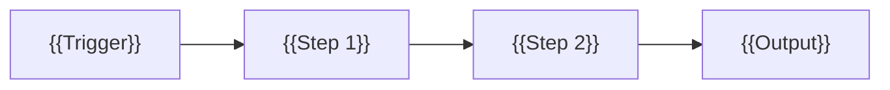

# {{WORKFLOW_NAME}}

> {{ONE_LINE_DESCRIPTION}}

## Overview

{{WHAT_THIS_WORKFLOW_DOES — 2-3 sentences}}

**Trigger:** {{webhook / schedule / manual}}
**Nodes:** {{COUNT}}
**LLM:** {{model name or "none"}}
**Category:** {{agents / pipelines / triggers / utilities}}

## Flow



## Nodes

| Node | Type | Purpose |
|---|---|---|
| {{Node Name}} | {{n8n node type}} | {{What it does}} |

## Test

**Endpoint:** `POST /webhook/{{path}}`

```bash
curl -X POST http://localhost:5678/webhook/{{path}} \
  -H "Content-Type: application/json" \
  -d '{{TEST_PAYLOAD}}'
```

**Expected:** {{EXPECTED_OUTPUT}}

See `test.json` for all test payloads.

## Benchmark

{{If applicable — before/after comparison. Delete this section if not relevant.}}

| Metric | Before | After | Improvement |
|---|---|---|---|
| {{metric}} | {{value}} | {{value}} | {{%}} |

## Install

```bash
npx --yes n8nac push {{FILENAME}}.workflow.ts
```

Or import `workflow/workflow.json` through the n8n UI.

## Status

- [ ] Workflow built
- [ ] Tested with payloads
- [ ] Benchmarked (if applicable)
- [ ] workflow.ts exported
- [ ] Ready to distribute
