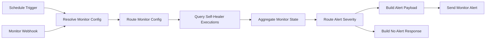

# Self-Healing Monitor

> Scheduled monitoring workflow for recent Self-Healer executions.

## Overview

This workflow polls recent executions of the `Self-Healer` workflow from the n8n API, aggregates heal and escalation outcomes, and raises warning or high-priority alerts when the thresholds in `docs/monitoring.md` are crossed. It also exposes a webhook for config priming and repeatable test runs because the scheduled path needs an n8n API key and optional Slack webhook stored in workflow static data.

**Trigger:** schedule + webhook
**Nodes:** 11
**LLM:** none
**Category:** utilities

## Flow



## Nodes

| Node | Type | Purpose |
|---|---|---|
| Schedule Trigger | `scheduleTrigger` | Runs the monitor every 15 minutes |
| Monitor Webhook | `webhook` | Stores config and provides an explicit test entrypoint |
| Resolve Monitor Config | `code` | Merges webhook payload overrides with persisted static config |
| Query Self-Healer Executions | `httpRequest` | Calls the n8n executions API with `includeData=true` |
| Aggregate Monitor State | `code` | Computes 30m and 60m threshold state from recent executions |
| Route Alert Severity | `switch` | Routes `none`, `warning`, and `high` outcomes |
| Send Monitor Alert | `httpRequest` | Posts a Slack-compatible alert payload |

## Test

**Endpoint:** `POST /webhook/self-healing-monitor`

```bash
curl -X POST http://localhost:5678/webhook/self-healing-monitor \
  -H "Content-Type: application/json" \
  -d '{
    "n8n_api_key": "YOUR_N8N_API_KEY",
    "slack_webhook_url": "https://hooks.slack.com/services/...",
    "expect_openrouter": false
  }'
```

**Expected:** JSON summary containing `status`, `severity`, `reasons`, and aggregated execution counts.

See `test.json` for all test payloads.

## Install

```bash
npx --yes n8nac push 172_31_224_1:5678_marius\ _j/personal/monitor.workflow.ts --verify
```

Or import `workflow/workflow.json` through the n8n UI.

## Status

- [x] Workflow built
- [x] Tested with payloads
- [x] workflow.ts exported
- [x] Ready to distribute
